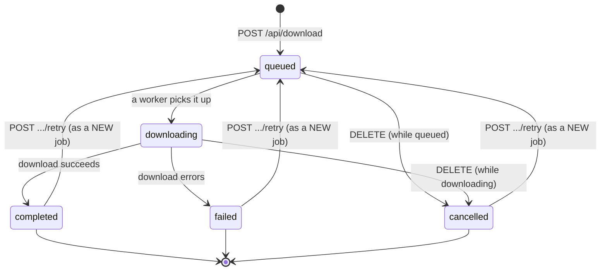

# Download Job Lifecycle

When you submit a download over the REST API, the server does not block the request
until the file is written. Instead it creates a **job**, hands it back to you with an
ID, and works through it in the background. Everything you do afterwards (watching
progress, cancelling, retrying, reading the result) is done by referring to that job
ID.

This page explains the states a job moves through, how live progress is reported, how
to cancel or retry, and, in clearly marked developer sections, how the worker and
manager behind the queue actually run the download.

!!! info "Who this page is for"
    The first half is for anyone driving the API: the states, the fields you can read,
    and the calls that move a job around. The **Under the hood** sections near the end
    describe the internal worker/manager model and are aimed at contributors and people
    debugging the server. You do not need them to use the API.

For the full request and response shape of each endpoint, see
[Endpoints](endpoints.md). For how errors are reported, see
[Error Responses](errors.md).

## The five states

A job is always in exactly one of five states, exposed as the `status` field:

| Status | Meaning |
|---|---|
| `queued` | Created and waiting for a free worker. No download has started yet. |
| `downloading` | A worker has picked the job up and the download is in progress. |
| `completed` | The download finished successfully; `output_files` lists the results. |
| `failed` | The download stopped with an error; `error_message` and `error_code` explain why. |
| `cancelled` | The job was cancelled before it could finish, from either the queued or downloading state. |

The last three (`completed`, `failed`, and `cancelled`) are **terminal**: once a
job reaches one of them it never changes state again. Terminal jobs can be removed,
retried, or read from history, but they will not resume.

## How a job moves between states



The transitions in prose:

- **`queued` → `downloading`** happens automatically. As soon as one of the server's
  workers is free, it takes the next job off the queue and starts it. You do not
  trigger this; you only observe it.
- **`downloading` → `completed`** is the happy path: the download engine wrote all the
  requested files and reported success.
- **`downloading` → `failed`** is any error during the download: a service failure, a
  network problem, a DRM error, and so on. The job records what went wrong.
- **`queued`/`downloading` → `cancelled`** happens when you send a `DELETE` for a job
  that has not finished (see [Cancelling a job](#cancelling-a-job)).
- **Retry** does *not* move a terminal job back to `queued`. Instead it creates a
  brand-new job that reuses the old job's service, title, and parameters. The original
  job stays in its terminal state (see [Retrying a job](#retrying-a-job)).

!!! note "Priority does not change status"
    Moving a job to the front of the queue with the priority endpoint reorders *when*
    it will start, but it stays `queued` until a worker actually picks it up. It is not
    a state change.

## Creating a job

A download is queued with `POST /api/download`. The request needs at least a `service`
and a `title_id`, plus any download options you want to set. On success the server
replies with **`202 Accepted`** and the new job's identity:

```shell title="Queue a download"
curl -X POST http://127.0.0.1:8786/api/download \
  -H "X-Secret-Key: your-api-secret" \
  -H "Content-Type: application/json" \
  -d '{
        "service": "EXAMPLE",
        "title_id": "81234567",
        "quality": ["1080"],
        "range": ["HDR10"]
      }'
```

```json title="202 Accepted"
{
  "job_id": "b1e6c7de-6d0a-4f2f-9d1e-3a2b4c5d6e7f",
  "status": "queued",
  "created_time": "2026-07-03T12:00:00.000000"
}
```

The job starts in `queued`. Workers auto-start on the first job submitted, so there is
nothing else to switch on. Keep the `job_id`; every later call is addressed to it.

!!! tip "The full parameter set"
    `POST /api/download` accepts the same download options as the `dl` command
    (quality, codecs, language selection, `wanted` episode ranges, and many more), with
    server-side defaults filling in anything you omit. The complete list, their
    defaults, and validation rules are documented on the [Endpoints](endpoints.md) page.

## Reading a job's status and progress

There are two ways to look at jobs.

=== "One job in full"

    `GET /api/download/jobs/{job_id}` returns the complete detail for a single job,
    including parameters (with secrets redacted), timing, output files, and error
    information if it failed.

    ```shell
    curl http://127.0.0.1:8786/api/download/jobs/b1e6c7de-6d0a-4f2f-9d1e-3a2b4c5d6e7f \
      -H "X-Secret-Key: your-api-secret"
    ```

=== "All jobs (summaries)"

    `GET /api/download/jobs` lists every job the manager currently holds. By default
    each entry is a **summary**. Pass `full=true` to get the same full detail as the
    single-job endpoint for every job.

    ```shell
    curl "http://127.0.0.1:8786/api/download/jobs?status=downloading&sort_by=progress&sort_order=desc" \
      -H "X-Secret-Key: your-api-secret"
    ```

    The list can be filtered by `status` and `service`, and ordered with `sort_by`
    (`created_time`, `started_time`, `completed_time`, `progress`, `status`, or
    `service`) and `sort_order` (`asc` / `desc`). See [Endpoints](endpoints.md) for the
    query-parameter reference.

### The progress fields

While a job is `downloading`, the following fields update roughly twice a second so a
client can poll and render live progress. They are present on both the summary and the
full detail:

| Field | Type | Meaning |
|---|---|---|
| `progress` | number `0` to `100` | Overall percent complete. |
| `phase` | string | Human-readable phase, e.g. `downloading video 1080p HDR10, audio en 5.1`. |
| `title` | string | Title being processed. |
| `current_title` | string | The specific episode/movie in progress (for a batch). |
| `completed_tracks` | int | Number of tracks finished so far. |
| `total_tracks` | int | Total tracks selected for the download. |
| `active_tracks` | list of strings | Labels of the tracks downloading right now. |
| `track_progress` | list | Per-active-track `{label, progress, speed}` entries. |
| `segments_done` | number | Segments downloaded for the track in progress. |
| `segments_total` | number | Total segments for the track in progress. |
| `speed` | string | Transfer speed of the track in progress, e.g. `4.20 MB/s`. |
| `skipped_subtitles` | list | Subtitles that were skipped as non-fatal failures (when `skip_subtitle_errors` is set). |

The full detail adds `started_time`, `completed_time`, `output_files`, the redacted
`parameters`, and, for failed jobs, `error_message`, `error_details`, `error_code`,
`error_traceback`, and `worker_stderr`.

!!! example "A typical polling loop"
    ```shell
    JOB=b1e6c7de-6d0a-4f2f-9d1e-3a2b4c5d6e7f
    while true; do
      curl -s "http://127.0.0.1:8786/api/download/jobs/$JOB" \
        -H "X-Secret-Key: your-api-secret" \
        | python -c 'import sys,json; d=json.load(sys.stdin); print(d["status"], d["progress"], d.get("phase"))'
      sleep 1
    done
    ```

!!! note "What the percentage means"
    `progress` climbs from `0` toward `90` while tracks download, then the final stretch
    to `100` covers post-download work such as decryption cleanup, repackaging, and
    muxing. A job that has finished downloading but is still muxing can sit near `90`
    for a moment before completing. On success the manager sets it to exactly `100`.

!!! warning "For a batch, `progress` is per-episode, not whole-batch"
    A multi-episode request (a `wanted` range) is a **single job** that processes its
    episodes sequentially. As each new episode begins, `progress` and the track counts
    (`completed_tracks` / `total_tracks`) **reset to zero** and count up again for that
    episode alone. The top-level bar therefore tracks the *current* episode, not the
    batch as a whole. To derive true overall completion, compare the growing
    `output_files` array against `parameters.wanted` rather than trusting `progress`.

## Terminal states in detail

### Completed

A `completed` job has its `output_files` populated with the paths of the muxed
results, and `progress` is `100`. This is the state you are waiting for.

### Failed

A `failed` job carries the error. `error_message` is the short human message,
`error_code` is one of the API's structured error codes (for example `NETWORK_ERROR`,
`DRM_ERROR`, `AUTH_FAILED`, or `DOWNLOAD_ERROR`), and `error_details` gives more
context. When the server was started with `--debug-api`, `error_traceback` and
`worker_stderr` are also filled in for diagnosis.

!!! tip "Secrets are scrubbed from error text"
    A service can echo a credential or a proxy URL into its output. The server masks
    any known secret values out of `error_message`, `error_details`, `error_traceback`,
    and `worker_stderr` before returning them, so it is safe to log these fields.

The error-code catalogue and how each maps to an HTTP status is on the
[Error Responses](errors.md) page.

### Cancelled

A `cancelled` job was stopped on request before finishing. It may have partial output,
but it is not considered complete. See below.

## Cancelling a job

Send `DELETE /api/download/jobs/{job_id}`. The behaviour depends on the job's current
state, and this is important because the response differs:

| Job state when you DELETE | What happens | Response |
|---|---|---|
| `queued` or `downloading` | The job is cancelled. A running download's worker process is terminated. | `200` with `{"status": "success", "message": "Job cancelled"}` |
| `completed`, `failed`, or `cancelled` (terminal) | The job is **removed** from the manager entirely. | `204 No Content`, empty body |
| Not found | - | `404` with error code `JOB_NOT_FOUND` |

In other words, `DELETE` on a live job *cancels* it, while `DELETE` on an already
finished job *deletes it from the list*. This dual meaning is deliberate: one verb
both stops in-flight work and tidies up afterwards.

!!! warning "Do not parse the body of a 204"
    Removing a terminal job returns `204 No Content` with an empty body. A client must
    not try to decode JSON from it; check the status code first.

```shell title="Cancel a running job"
curl -X DELETE http://127.0.0.1:8786/api/download/jobs/b1e6c7de-6d0a-4f2f-9d1e-3a2b4c5d6e7f \
  -H "X-Secret-Key: your-api-secret"
```

To remove *all* terminal jobs at once, use `POST /api/download/jobs/clear-finished`,
which returns `{"removed": <count>}`.

## Retrying a job

`POST /api/download/jobs/{job_id}/retry` re-runs a finished job by creating a **new**
job with the same service, title, and parameters. The original job is untouched and
stays in its terminal state; the response gives you the new job's ID with `202`.

- Only terminal jobs can be retried. Retrying a `queued` or `downloading` job returns
  `409` with error code `CONFLICT`.
- A missing job returns `404` (`JOB_NOT_FOUND`).
- The service allowlist and any download gates are re-checked for the new job, exactly
  as they were for the original submission, so a retry can be rejected with
  `INVALID_SERVICE` or `FORBIDDEN` if permissions changed.

```json title="202 Accepted, a fresh job"
{
  "job_id": "c2f7d8ef-7e1b-5a3a-ae2f-4b3c5d6e7f80",
  "status": "queued",
  "created_time": "2026-07-03T12:30:00.000000"
}
```

## Prioritising a job

`POST /api/download/jobs/{job_id}/priority` moves a **queued** job to the front of the
line, so it will be the next one a free worker picks up.

- The job must be `queued`. Prioritising a job in any other state returns `409`
  (`CONFLICT`); a missing job returns `404`.
- On success the response is `{"job_id": "<id>", "position": "front"}`.

This only reorders the queue; the job's status stays `queued` until a worker starts
it.

## History and retention

Every job that reaches a terminal state is also written once to a persistent history
log, so it survives even after the job is removed from the live list.

- Read it with `GET /api/history` (newest first; supports `limit` and `service`
  filters).
- Delete a single entry with `DELETE /api/history/{job_id}` (returns `204`).

The live in-memory jobs are separate from this on-disk history. A background cleanup
task periodically drops old terminal jobs from the live list based on a retention
period; the history file keeps them for later reference. See [Endpoints](endpoints.md)
for the history response shape.

!!! note "Why the history file lives under the cache directory"
    `api_history.jsonl` is placed under the cache directory on purpose, so it stays out
    of the config/data tree. It is disposable runtime state, not user configuration or
    curated data, which is exactly why clearing the cache is a safe operation against
    it.

---

## Under the hood: the worker/manager model

!!! info "Developer section"
    Everything below describes server internals. It is useful for contributors and for
    anyone debugging the server, but it is not needed to *use* the API.

### The manager and its queue

A single process-wide **download queue manager** owns all jobs. It holds them in
memory keyed by ID, backs the wait list with a FIFO queue, and keeps a separate
priority deque for jobs that have been bumped to the front. On the first job, it starts
a fixed pool of worker tasks plus one cleanup task; starting is idempotent, so later
jobs reuse the same pool.

- **Concurrency** is capped by `max_concurrent_downloads` (default **2**). That many
  jobs can be in `downloading` at once; the rest wait in `queued`.
- **Retention** is governed by `job_retention_hours` (default **24**). An hourly
  cleanup task removes terminal jobs whose completion time (or, if never started,
  creation time) is older than the retention window.

!!! note "Two concurrency knobs that are easy to conflate"
    `max_concurrent_downloads` caps how many separate download **jobs** run at once.
    The separate `serve.downloads` setting controls how many **tracks** download in
    parallel *within* a single job. They are independent, and raising one does not affect
    the other.

!!! note "Concurrency and retention config keys"
    The manager reads these as top-level config attributes
    (`config.max_concurrent_downloads` and `config.download_job_retention_hours`).
    Those keys are not part of the standard config schema, so in practice the built-in
    defaults of **2** and **24** apply. The live values are surfaced by
    [`GET /api/config`](endpoints.md). The related `serve.history_limit` (default
    **100**) instead controls how many entries the on-disk history file keeps.

Each worker loop drains the priority deque first, then the FIFO queue. A job that was
promoted has its stale FIFO copy skipped so it does not run twice. When a worker takes
a job it flips it to `downloading`, stamps `started_time`, runs it, and on finish
stamps `completed_time` and records history.

### Each job runs in its own subprocess

The manager does **not** run the download in the server's event loop or even in the
server process. For each job it spawns a separate Python subprocess:

```text
python -m evied.core.api.download_worker <payload.json> <result.json> <progress.json>
```

Three temporary files bridge the parent and the worker:

- **`payload.json`**: written by the manager before launch; contains the job ID,
  service, title ID, and merged parameters.
- **`progress.json`**: written continuously by the worker as the download proceeds.
- **`result.json`**: written by the worker at the end.

Running each download out-of-process isolates the server from crashes, memory growth,
and blocking work inside the download engine, and makes hard cancellation (killing the
process) reliable.

The worker's exit codes are `0` for success, `1` for a download error, and `2` for bad
arguments. Its `result.json` is either `{"status": "success", "output_files": [...]}`
or `{"status": "error", "message", "error_details", "error_code", "traceback"}`. If the
process exits non-zero, or the result is missing or not a success, the parent marks the
job `failed` and adopts the worker's `error_code` (or derives one by categorising the
exception).

### How progress reaches the API

While the worker runs, the manager polls `progress.json` every **0.5 s** and copies the
fields it finds onto the live `DownloadJob`. That is what the `GET` endpoints return.

Inside the worker, progress is aggregated across all selected tracks. Each track's
completion fraction is weighted by its bitrate, so video and audio dominate the bar and
subtitles barely move it (subtitles get a small fixed weight). Track fractions are kept
**monotonic**: the percentage only ever climbs. The download portion is scaled to fill
`0` to `90`; the remaining `90` to `100` is driven by the download engine as it repackages
and muxes. A track counts as done when it reaches a terminal state such as
`Downloaded`, `Decrypted`, or a skipped subtitle.

### How cancellation actually works

Each job carries a cancellation event. When you `DELETE` a live job:

- If it is **`queued`**, it flips straight to `cancelled`, its history is recorded
  immediately (it never reaches a worker), and the worker loop skips it if it later
  pops it off the queue.
- If it is **`downloading`**, the manager sets the cancellation event and flips the job
  to `cancelled`. The polling loop notices the event, `terminate()`s the worker
  subprocess (escalating to `kill()` if it does not exit within 5 seconds), and raises
  a cancellation so the task unwinds. The subprocess model is what makes this a clean,
  immediate stop rather than a cooperative one.

### Secret handling in serialized jobs

Job parameters may carry secrets: a raw `user:pass` credential, or a proxy URL with
embedded userinfo. Whenever the manager serializes a job (for an API response or the
history file), it masks the sensitive keys (`credential`, `credentials`, `password`,
`token`, `api_key`) and strips userinfo from proxy URLs. Free-text fields that a
service might have leaked a secret into (`error_message`, `error_details`,
`error_traceback`, `worker_stderr`, and worker stdout/stderr in the logs) are scrubbed
of the job's known secret values, longest-match first, before they are ever returned or
logged.

## See also

- [Endpoints](endpoints.md): the full request/response reference for every job endpoint.
- [Error Responses](errors.md): the error envelope, codes, and HTTP statuses a failed job reports.
- [Authentication](authentication.md): the `X-Secret-Key` header and per-key service allowlists that gate job creation and retry.
- [Downloading](../../guide/downloading.md): the equivalent options on the `dl` command line.
